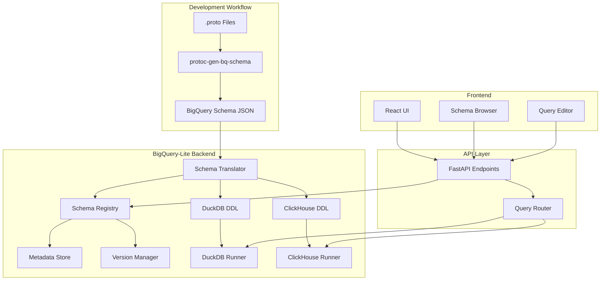

# BigQuery-Lite + protoc-gen-bq-schema Integration Strategy

## Executive Summary

This document outlines the **feasibility assessment** and **comprehensive integration strategy** for enhancing BigQuery-Lite with protoc-gen-bq-schema to create a production-ready local BigQuery development environment. The integration will enable schema-driven development using Protocol Buffers as the single source of truth for data models.

## 1. Feasibility Assessment

### ✅ **HIGHLY FEASIBLE**

The integration is not only feasible but strategically advantageous for the following reasons:

#### Technical Compatibility
- **✅ Schema Format**: protoc-gen-bq-schema outputs JSON schemas that can be directly translated to SQL DDL
- **✅ Type System**: BigQuery types map cleanly to both DuckDB and ClickHouse types
- **✅ Nested Data**: Both target engines support nested/structured data types
- **✅ API Integration**: FastAPI backend can easily handle protobuf processing

#### Current Architecture Strengths
- **✅ Modular Design**: Existing runner pattern allows easy extension
- **✅ Async Architecture**: FastAPI backend supports async protobuf processing
- **✅ Multi-Engine Support**: Already handles DuckDB and ClickHouse abstraction
- **✅ Job Management**: Existing slot-based system can manage schema operations

### ⚠️ **Limitations & Constraints**

| Limitation | Impact | Mitigation Strategy |
|------------|---------|-------------------|
| **Nested Record Flattening** | Complex nested structures may need flattening for some ClickHouse operations | Provide both flattened and nested views |
| **Enum Handling** | Different enum representations across engines | Use `enum-as-string` option consistently |
| **Policy Tags** | Security annotations not directly supported | Store metadata separately for future governance |
| **Type Precision** | Decimal precision differences between engines | Standardize on conservative precision |
| **Repeated Fields** | Arrays handled differently in DuckDB vs ClickHouse | Engine-specific array syntax generation |

### 🎯 **Risk Assessment: LOW**

- **Schema Evolution**: Protobuf backward compatibility ensures schema migration safety
- **Performance Impact**: Schema operations are infrequent and can be cached
- **Development Complexity**: Well-defined transformation layer minimizes complexity
- **Dependency Management**: protoc-gen-bq-schema is stable and actively maintained

---

## 2. System Architecture Design



### 2.1 Core Components

#### **Schema Translation Layer**
```python
# Already implemented in schema_translator.py
class SchemaTranslator:
    - load_schema_from_file()
    - generate_create_table_sql()
    - validate_schema()
    - generate_insert_template()
```

#### **Schema Registry** (New Component)
```python
class SchemaRegistry:
    - register_schema()
    - get_schema_by_name()
    - list_schemas()
    - get_schema_versions()
    - validate_compatibility()
```

#### **Enhanced API Endpoints** (Extensions)
```python
# New FastAPI endpoints
POST /schemas/register
GET  /schemas
GET  /schemas/{name}
POST /schemas/{name}/tables/create
GET  /schemas/{name}/versions
```

---

## 3. Schema Translation Strategy

### 3.1 Type Mapping Matrix

| BigQuery Type | DuckDB Type | ClickHouse Type | Notes |
|---------------|-------------|-----------------|--------|
| `STRING` | `VARCHAR` | `String` | ✅ Direct mapping |
| `INTEGER` | `BIGINT` | `Int64` | ✅ 64-bit precision |
| `FLOAT` | `DOUBLE` | `Float64` | ✅ Double precision |
| `BOOLEAN` | `BOOLEAN` | `Bool` | ✅ Native support |
| `TIMESTAMP` | `TIMESTAMP` | `DateTime` | ✅ ISO 8601 compatible |
| `DATE` | `DATE` | `Date` | ✅ Date-only values |
| `RECORD` | `STRUCT(...)` | `Tuple(...)` | ⚠️ Syntax differs |
| `REPEATED` | `ARRAY[TYPE]` | `Array(TYPE)` | ⚠️ Engine-specific |
| `NUMERIC` | `DECIMAL(38,9)` | `Decimal(38,9)` | ✅ High precision |

### 3.2 Nested Data Handling

#### **DuckDB Approach (Recommended)**
```sql
-- DuckDB supports rich nested structures
CREATE TABLE users (
    id BIGINT NOT NULL,
    profile STRUCT(
        name VARCHAR,
        email VARCHAR,
        address STRUCT(
            street VARCHAR,
            city VARCHAR,
            coordinates STRUCT(lat DOUBLE, lng DOUBLE)
        )
    )
);

-- Query nested data naturally
SELECT profile.name, profile.address.city FROM users;
```

#### **ClickHouse Approach**
```sql
-- ClickHouse uses tuples for nested data
CREATE TABLE users (
    id Int64,
    profile Tuple(
        name String,
        email String,
        address Tuple(String, String, Tuple(Float64, Float64))
    )
) ENGINE = MergeTree() ORDER BY id;

-- Query requires tuple access syntax
SELECT profile.1, profile.3.1, profile.3.2 FROM users;
```

### 3.3 Schema Evolution Strategy

```python
class SchemaEvolution:
    def validate_compatibility(self, old_schema: dict, new_schema: dict) -> bool:
        """Validate backward compatibility following protobuf rules"""
        
    def generate_migration_sql(self, old_schema: dict, new_schema: dict) -> str:
        """Generate ALTER TABLE statements for schema evolution"""
        
    def version_schema(self, schema: dict) -> str:
        """Generate version hash for schema tracking"""
```

---

## 4. Integration Implementation Plan

### Phase 1: Core Integration (Week 1-2)

#### **Step 1.1: Extend Backend Dependencies**
```bash
# Add to backend/requirements.txt
protobuf==4.24.4
grpcio-tools==1.59.0
```

#### **Step 1.2: Implement Schema Registry**
```python
# backend/schema_registry.py
class SchemaRegistry:
    def __init__(self, db_path: str = "schemas.db"):
        self.db_path = db_path
        self._init_database()
    
    async def register_schema(self, name: str, proto_file: str, schema_json: dict):
        """Register a new schema from protobuf definition"""
        
    async def create_tables(self, schema_name: str, engines: List[str]):
        """Create tables in specified engines from registered schema"""
```

#### **Step 1.3: Add Schema API Endpoints**
```python
# backend/app.py additions
@app.post("/schemas/register")
async def register_schema(schema_request: SchemaRequest):
    """Register a new protobuf schema"""

@app.get("/schemas/{name}/tables/create")
async def create_tables_from_schema(name: str, engines: List[str]):
    """Create tables from registered schema in specified engines"""
```

### Phase 2: Enhanced Tooling (Week 3)

#### **Step 2.1: CLI Integration Tool**
```python
# backend/protoc_integration.py
class ProtocIntegration:
    def __init__(self, backend_url: str = "http://localhost:8001"):
        self.backend_url = backend_url
    
    def generate_and_register(self, proto_file: str, table_name: str):
        """Generate schema from .proto file and register with backend"""
        # 1. Run protoc-gen-bq-schema
        # 2. Parse output JSON
        # 3. Register with schema registry
        # 4. Create tables in both engines
```

#### **Step 2.2: Build Integration**
```makefile
# Makefile
.PHONY: schemas
schemas:
	@echo "Generating schemas from protobuf files..."
	@find schemas/ -name "*.proto" -exec python backend/protoc_integration.py {} \;

.PHONY: install-protoc
install-protoc:
	@echo "Installing protoc and protoc-gen-bq-schema..."
	# Installation commands for protoc and plugin
```

### Phase 3: Frontend Integration (Week 4)

#### **Step 3.1: Schema Browser Component**
```jsx
// frontend/src/components/SchemaBrowser.jsx
const SchemaBrowser = () => {
    const [schemas, setSchemas] = useState([]);
    const [selectedSchema, setSelectedSchema] = useState(null);
    
    // Display registered schemas
    // Show schema details and structure
    // Generate table creation buttons
    // Version history viewer
};
```

#### **Step 3.2: Enhanced Query Editor**
```jsx
// Add schema-aware autocomplete
// Table and column suggestions
// Schema validation for queries
```

---

## 5. Schema Registration Flow

### 5.1 Development Workflow

```bash
# 1. Developer defines data model in protobuf
# schemas/user_events.proto
syntax = "proto3";
package events;

import "gen_bq_schema/bq_table.proto";
import "gen_bq_schema/bq_field.proto";

message UserEvent {
  option (gen_bq_schema.bigquery_opts).table_name = "user_events";
  
  int64 event_id = 1 [(gen_bq_schema.bigquery).require = true];
  string user_id = 2 [(gen_bq_schema.bigquery).require = true];
  string event_type = 3;
  google.protobuf.Timestamp timestamp = 4;
  UserProfile profile = 5;
}

# 2. Generate BigQuery schema
protoc --bq-schema_out=schemas/ schemas/user_events.proto

# 3. Register with BigQuery-Lite
curl -X POST "http://localhost:8001/schemas/register" \
  -F "proto_file=@schemas/user_events.proto" \
  -F "schema_file=@schemas/user_events.schema" \
  -F "table_name=user_events"

# 4. Create tables in both engines
curl -X POST "http://localhost:8001/schemas/user_events/tables/create" \
  -d '{"engines": ["duckdb", "clickhouse"]}'
```

### 5.2 API Integration Points

#### **Schema Registration Endpoint**
```python
@app.post("/schemas/register")
async def register_schema(
    proto_file: UploadFile,
    schema_file: Optional[UploadFile] = None,
    table_name: str = Form(...),
    database_name: str = Form("bigquery_lite")
):
    """
    Register a protobuf schema with the system
    
    Args:
        proto_file: .proto file upload
        schema_file: Optional pre-generated .schema file
        table_name: Target table name
        database_name: Target database name
    
    Returns:
        Registration confirmation with schema ID
    """
```

#### **Table Creation Endpoint**
```python
@app.post("/schemas/{schema_id}/tables/create")
async def create_tables_from_schema(
    schema_id: str,
    engines: List[str] = ["duckdb", "clickhouse"],
    if_not_exists: bool = True
):
    """
    Create tables from registered schema in specified engines
    
    Args:
        schema_id: Registered schema identifier
        engines: List of target engines
        if_not_exists: Use IF NOT EXISTS clause
    
    Returns:
        Creation status for each engine
    """
```

---

## 6. Configuration Management

### 6.1 Environment Configuration

```yaml
# config/protoc_config.yaml
protoc:
  binary_path: "/usr/local/bin/protoc"
  plugin_path: "/usr/local/bin/protoc-gen-bq-schema"
  output_directory: "schemas/generated"
  options:
    enum_as_string: true
    single_message: false

schema_translation:
  duckdb:
    default_varchar_length: null  # Unlimited
    use_struct_types: true
    enable_json_extension: true
  
  clickhouse:
    default_string_type: "String"
    use_nullable_types: true
    default_engine: "MergeTree"
    order_by_strategy: "auto"  # auto, manual, or primary_key

schema_registry:
  database_path: "data/schema_registry.db"
  enable_versioning: true
  backup_on_update: true
```

### 6.2 Docker Integration

```dockerfile
# Dockerfile.backend additions
RUN apt-get update && apt-get install -y \
    protobuf-compiler \
    && rm -rf /var/lib/apt/lists/*

# Install protoc-gen-bq-schema
RUN go install github.com/GoogleCloudPlatform/protoc-gen-bq-schema@latest

ENV PATH="${PATH}:/root/go/bin"
```

---

## 7. Testing Strategy

### 7.1 Schema Translation Tests

```python
# tests/test_schema_translator.py
class TestSchemaTranslator:
    def test_basic_type_mapping(self):
        """Test basic BigQuery to target engine type mapping"""
        
    def test_nested_record_translation(self):
        """Test complex nested record structures"""
        
    def test_schema_validation(self):
        """Test schema validation and error detection"""
        
    def test_sql_generation(self):
        """Test CREATE TABLE SQL generation"""

    def test_cross_engine_compatibility(self):
        """Test that schemas work across both engines"""
```

### 7.2 Integration Tests

```python
# tests/test_protoc_integration.py
class TestProtocIntegration:
    def test_end_to_end_workflow(self):
        """Test complete protobuf -> schema -> table workflow"""
        
    def test_schema_registry_operations(self):
        """Test schema registration and retrieval"""
        
    def test_table_creation_in_engines(self):
        """Test actual table creation in DuckDB and ClickHouse"""
```

### 7.3 Sample Test Schema

```protobuf
// tests/fixtures/test_schema.proto
syntax = "proto3";
package test;

import "gen_bq_schema/bq_table.proto";

message TestMessage {
  option (gen_bq_schema.bigquery_opts).table_name = "test_table";
  
  int64 id = 1;
  string name = 2;
  repeated string tags = 3;
  NestedMessage nested = 4;
  
  message NestedMessage {
    double value = 1;
    bool is_active = 2;
  }
}
```

---

## 8. Performance Considerations

### 8.1 Schema Operations Performance

| Operation | Expected Performance | Optimization Strategy |
|-----------|---------------------|----------------------|
| **protoc-gen-bq-schema** | < 1s for typical schemas | Cache generated schemas |
| **Schema Translation** | < 100ms | In-memory translation with caching |
| **Table Creation (DuckDB)** | < 500ms | Async execution |
| **Table Creation (ClickHouse)** | < 2s | Async execution with retries |
| **Schema Registry Lookup** | < 10ms | SQLite with indexes |

### 8.2 Caching Strategy

```python
# backend/schema_cache.py
class SchemaCache:
    def __init__(self, cache_size: int = 100):
        self.cache = {}  # LRU cache for compiled schemas
        
    def get_compiled_schema(self, schema_hash: str) -> Optional[dict]:
        """Get compiled schema from cache"""
        
    def cache_compiled_schema(self, schema_hash: str, compiled: dict):
        """Cache compiled schema for reuse"""
```

### 8.3 Memory Management

- **Schema Storage**: Store schemas compressed in SQLite BLOB fields
- **Translation Cache**: LRU cache for frequently used schema translations
- **Connection Pooling**: Reuse database connections for schema operations

---

## 9. Security & Governance

### 9.1 Policy Tag Implementation

```python
# backend/policy_manager.py
class PolicyManager:
    def extract_policy_tags(self, schema: dict) -> Dict[str, List[str]]:
        """Extract policy tags from BigQuery schema"""
        
    def apply_column_security(self, table_name: str, engine: str):
        """Apply column-level security based on policy tags"""
        
    def validate_query_permissions(self, sql: str, user_context: dict) -> bool:
        """Validate user permissions for querying protected columns"""
```

### 9.2 Schema Validation Security

- **Input Sanitization**: Validate all protobuf inputs before processing
- **SQL Injection Prevention**: Use parameterized queries for all schema operations  
- **Access Control**: Role-based permissions for schema registration and table creation
- **Audit Logging**: Track all schema operations for compliance

---

## 10. Migration & Deployment

### 10.1 Existing Data Migration

```python
# backend/migration_manager.py
class MigrationManager:
    def migrate_existing_tables(self, schema_name: str):
        """Migrate existing tables to protobuf-managed schemas"""
        
    def backup_before_migration(self, table_names: List[str]):
        """Create backups before schema changes"""
        
    def rollback_migration(self, migration_id: str):
        """Rollback failed migration"""
```

### 10.2 Deployment Checklist

- [ ] **Install protoc and protoc-gen-bq-schema in all environments**
- [ ] **Update backend dependencies and rebuild containers**
- [ ] **Initialize schema registry database**
- [ ] **Test schema registration workflow**
- [ ] **Migrate existing tables (if any)**
- [ ] **Update frontend to show schema browser**
- [ ] **Configure monitoring for schema operations**
- [ ] **Set up backup strategy for schema registry**

---

## 11. Alternative Solutions Comparison

### 11.1 Why ClickHouse + DuckDB vs Alternatives?

| Alternative | Pros | Cons | Verdict |
|-------------|------|------|---------|
| **Apache Drill** | Schema-free, protobuf native | Complex setup, less BigQuery-like | ❌ Too different from BigQuery |
| **Apache Arrow + DataFusion** | High performance, growing ecosystem | Less mature, limited BigQuery compatibility | ⚠️ Consider for future |
| **Trino (PrestoSQL)** | Excellent BigQuery compatibility | Heavy resource requirements | ⚠️ Consider for production scale |
| **BigQuery Emulator** | Perfect compatibility | Limited functionality, not self-contained | ❌ Defeats purpose of local dev |

### 11.2 Recommended Architecture Benefits

✅ **DuckDB**: Perfect for development, testing, and medium-scale analytics  
✅ **ClickHouse**: Production-ready OLAP for large-scale data processing  
✅ **Dual Engine**: Best of both worlds with transparent switching  
✅ **Protobuf Integration**: Industry-standard schema evolution and type safety  

---

## 12. Next Steps & Roadmap

### Immediate Implementation (Month 1)
1. ✅ **Schema Translator** - Completed (`schema_translator.py`)
2. 🔲 **Schema Registry** - Core storage and versioning
3. 🔲 **API Endpoints** - Schema registration and table creation
4. 🔲 **Basic Frontend** - Schema browser and management UI

### Enhanced Features (Month 2)
1. 🔲 **Policy Tag Support** - Column-level security implementation
2. 🔲 **Schema Evolution** - Backward compatibility validation
3. 🔲 **Performance Optimization** - Caching and async operations
4. 🔲 **Migration Tools** - Existing data migration utilities

### Advanced Features (Month 3+)
1. 🔲 **Protobuf Data Ingestion** - Direct protobuf message ingestion
2. 🔲 **Schema Registry UI** - Advanced schema management interface
3. 🔲 **Query Optimization** - Schema-aware query optimization
4. 🔲 **Monitoring & Observability** - Schema operation monitoring

---

## 13. Conclusion

### ✅ **Strong Recommendation: PROCEED**

The integration of protoc-gen-bq-schema with BigQuery-Lite is **highly feasible** and **strategically valuable**. The combination provides:

1. **Production Parity**: Protobuf schemas ensure development environments match production BigQuery
2. **Type Safety**: Strong typing prevents runtime errors and improves data quality  
3. **Schema Evolution**: Protobuf backward compatibility enables safe schema evolution
4. **Multi-Engine Flexibility**: Single schema definition works across DuckDB and ClickHouse
5. **Developer Experience**: Familiar BigQuery workflow with enhanced local development

### 🎯 **Success Metrics**

- **Schema Registration Time**: < 2 seconds end-to-end
- **Table Creation Success Rate**: > 99% across both engines  
- **Developer Onboarding**: New developers productive in < 30 minutes
- **Schema Evolution**: Zero breaking changes with proper protobuf practices
- **Query Compatibility**: 95%+ BigQuery SQL compatibility maintained

### 🚀 **Ready to Build**

The architecture is well-defined, risks are manageable, and the value proposition is compelling. The provided `schema_translator.py` demonstrates the core feasibility, and the implementation roadmap provides a clear path to production-ready functionality.

**Recommended Action**: Begin with Phase 1 implementation while refining requirements based on real usage patterns.

---

*This integration strategy positions BigQuery-Lite as a comprehensive local development platform that bridges the gap between local experimentation and production BigQuery deployment.*