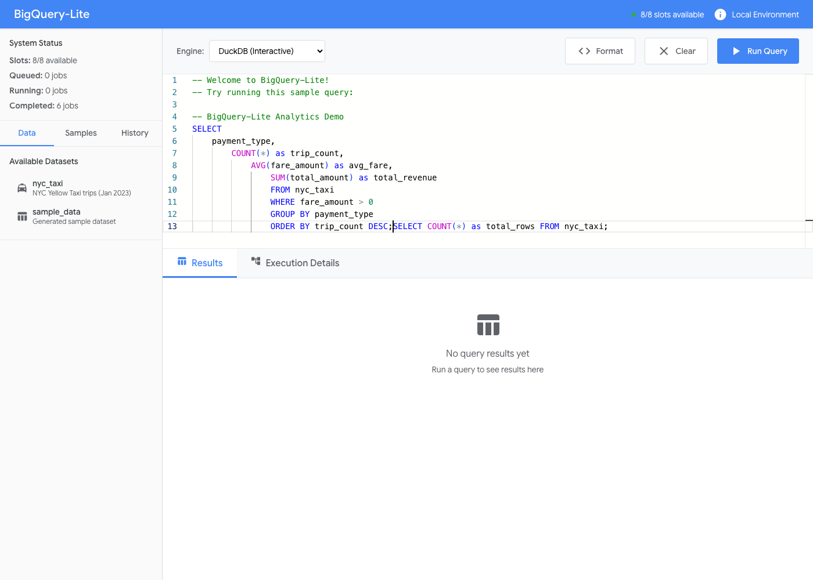

# BigQuery-Lite 🚀

A powerful local BigQuery-like analytics environment with a modern web interface, combining **DuckDB** for embedded analytics and **ClickHouse** for distributed OLAP processing. Experience BigQuery's capabilities without cloud dependencies!


> **📖 [Complete Documentation](docs/README.md)** | **🚀 [Quick Start](docs/getting-started/installation.md)** | **💻 [CLI Guide](docs/user-guide/cli-tool.md)** | **📚 [API Docs](docs/api/rest-api.md)**

## ✨ What is BigQuery-Lite?

BigQuery-Lite brings Google BigQuery's powerful analytics capabilities to your local environment. It features:

- 🎯 **Dual Analytics Engines**: DuckDB for lightning-fast embedded analytics + ClickHouse for distributed processing
- 🌐 **Modern Web Interface**: BigQuery-inspired UI with syntax highlighting and real-time results
- ⚡ **Slot-Based Scheduling**: Simulates BigQuery's resource allocation and query queuing system
- 📊 **Interactive Query Plans**: Detailed execution analysis and performance monitoring
- 🔄 **Real-time Job Management**: Track query execution with live status updates
- 📈 **Performance Metrics**: Comprehensive execution statistics and resource usage

## 🚀 Quick Start

### Option 1: Full Docker Setup (Recommended)

Get everything running with one command:

```bash
# Clone and navigate to the project
git clone <your-repo-url>
cd bigquery-lite

# Start all services
docker-compose up --build
```

**Access Points:**
- **🌐 Web Interface**: http://localhost:3000
- **📡 Backend API**: http://localhost:8001
- **🗄️ ClickHouse**: http://localhost:8123
- **📓 Jupyter Lab**: http://localhost:8888

### Option 2: Development Setup

For local development:

```bash
# Install dependencies
pip install -r backend/requirements.txt
cd frontend && npm install

# Start backend
cd backend && python app.py

# Start frontend (in another terminal)
cd frontend && npm start

# Start ClickHouse (optional)
docker-compose up clickhouse-server
```

## 🎨 User Interface Tour

### SQL Editor with Syntax Highlighting



The editor features:
- **Monaco Editor**: Same editor used in VS Code
- **SQL Syntax Highlighting**: Full BigQuery SQL support
- **Auto-completion**: Context-aware suggestions
- **Query Formatting**: Built-in SQL formatter
- **Engine Selection**: Choose between DuckDB and ClickHouse

### DuckDB Results - Lightning Fast Analytics


DuckDB provides:
- ⚡ **Sub-second query execution** on medium datasets
- 🧠 **In-memory processing** with intelligent caching
- 🔧 **Advanced SQL features** including window functions
- 📊 **Column-aware optimizations** for analytical workloads

### ClickHouse Results - Distributed Processing


ClickHouse offers:
- 🏗️ **Distributed query execution** across multiple nodes
- 📈 **Columnar storage** optimized for analytics
- ⚖️ **Horizontal scaling** capabilities
- 🎯 **Real-time analytics** on large datasets

### Simple Query Interface


Perfect for:
- 🔍 **Data exploration** and discovery
- 📋 **Quick data validation** checks
- 📊 **Dashboard prototyping**
- 🎓 **Learning SQL** concepts

## 📊 Sample Queries to Get Started

### Basic Data Exploration
```sql
-- Get overview of your dataset
SELECT COUNT(*) as total_trips, 
       AVG(fare_amount) as avg_fare,
       MAX(trip_distance) as max_distance
FROM nyc_taxi;
```

### Payment Analysis
```sql
-- Analyze payment patterns
SELECT 
    payment_type,
    COUNT(*) as trip_count,
    AVG(fare_amount) as avg_fare,
    SUM(total_amount) as total_revenue
FROM nyc_taxi 
WHERE fare_amount > 0 
GROUP BY payment_type 
ORDER BY trip_count DESC;
```

### Time Series Analysis
```sql
-- Daily trip patterns
SELECT 
    DATE(tpep_pickup_datetime) as pickup_date,
    EXTRACT(hour FROM tpep_pickup_datetime) as pickup_hour,
    COUNT(*) as trips_per_hour,
    AVG(fare_amount) as avg_hourly_fare
FROM nyc_taxi 
GROUP BY pickup_date, pickup_hour
ORDER BY pickup_date, pickup_hour;
```

### Advanced Window Functions
```sql
-- Moving averages and trends
WITH daily_stats AS (
    SELECT 
        DATE(tpep_pickup_datetime) as pickup_date,
        COUNT(*) as daily_trips,
        AVG(fare_amount) as avg_daily_fare
    FROM nyc_taxi 
    GROUP BY pickup_date
)
SELECT 
    pickup_date,
    daily_trips,
    avg_daily_fare,
    AVG(daily_trips) OVER (
        ORDER BY pickup_date 
        ROWS BETWEEN 6 PRECEDING AND CURRENT ROW
    ) as weekly_avg_trips
FROM daily_stats
ORDER BY pickup_date;
```

## 🏗️ Architecture Overview

BigQuery-Lite implements a **modular, layered architecture** with clean separation between presentation, business logic, and data access layers.

```
┌─────────────┐    ┌─────────────┐    ┌─────────────┐
│   Frontend  │    │   Backend   │    │ ClickHouse  │
│   (React)   │────│  (FastAPI)  │────│   Cluster   │
│   Port 3000 │    │  Port 8001  │    │  Port 8123  │
└─────────────┘    └─────────────┘    └─────────────┘
       │                   │                   │
       │                   ▼                   │
       │            ┌─────────────┐            │
       │            │   DuckDB    │            │
       └────────────│ (Embedded)  │────────────┘
                    └─────────────┘
```

### 📚 Detailed Architecture Documentation

Explore our comprehensive architecture documentation:

- **[🎯 System Overview](docs/architecture/system-overview.md)** - Purpose, goals, and high-level design patterns
- **[⚡ FastAPI Backend](docs/architecture/component-fastapi.md)** - API architecture, endpoints, and request handling
- **[🔧 Query Engines](docs/architecture/component-query-engines.md)** - DuckDB and ClickHouse integration patterns  
- **[🗄️ Schema Registry](docs/architecture/component-schema-registry.md)** - Protobuf schema management and DDL generation
- **[🚀 Development Environment](docs/architecture/deployment-dev-env.md)** - Local setup, Docker, and configuration
- **[🔌 System Interfaces](docs/architecture/interfaces.md)** - Internal/external APIs and integration patterns
- **[📊 Architecture Diagram](docs/architecture/architecture-diagram.mmd)** - Visual system overview (Mermaid)

### Technology Stack

**Frontend:**
- ⚛️ **React 18**: Modern UI framework with concurrent features
- 🎨 **Monaco Editor**: VS Code editor for professional SQL editing
- 📊 **Real-time Updates**: WebSocket-based live query status and results
- 🎯 **BigQuery-inspired Design**: Familiar interface for BigQuery users

**Backend:**
- 🐍 **FastAPI**: High-performance async Python API framework
- 🔄 **Async Processing**: Non-blocking query execution with job queuing
- 📋 **Slot-Based Scheduling**: BigQuery-like resource allocation system
- 📊 **Performance Monitoring**: Detailed execution metrics and query plans

**Data Engines:**
- 🦆 **DuckDB**: Embedded analytical database for interactive queries
- 🏠 **ClickHouse**: Distributed columnar database for scalable analytics
- 📊 **Protobuf Integration**: Schema-driven data ingestion with `protoc-gen-bq-schema`

## 🔧 Configuration & Setup

### Environment Variables

Create a `.env` file for custom configuration:

```env
# Backend Configuration
CLICKHOUSE_HOST=localhost
CLICKHOUSE_PORT=8123
CLICKHOUSE_USER=admin
CLICKHOUSE_PASSWORD=password

# Resource Limits
MAX_SLOTS=8
DEFAULT_QUERY_TIMEOUT=300

# Development
DEBUG=true
LOG_LEVEL=info
```

### Docker Services Configuration

The system includes several Docker services:

```yaml
services:
  frontend:    # React app with Nginx
  backend:     # FastAPI server
  clickhouse-server:   # Main ClickHouse coordinator
  clickhouse-worker1:  # Worker node 1
  clickhouse-worker2:  # Worker node 2
  jupyter:     # Optional Jupyter Lab for notebooks
```

**Port Mapping:**
| Service | Internal | External | Purpose |
|---------|----------|----------|---------|
| Frontend | 80 | 3000 | Web Interface |
| Backend | 8001 | 8001 | API Server |
| ClickHouse Main | 8123 | 8123 | HTTP Interface |
| ClickHouse Worker 1 | 8123 | 8124 | HTTP Interface |
| ClickHouse Worker 2 | 8123 | 8125 | HTTP Interface |
| Jupyter | 8888 | 8888 | Notebooks |

## 📡 API Reference

### Core Endpoints

```bash
# Submit a query
curl -X POST "http://localhost:8001/queries" \
  -H "Content-Type: application/json" \
  -d '{
    "sql": "SELECT COUNT(*) FROM nyc_taxi",
    "engine": "duckdb"
  }'

# Check job status
curl "http://localhost:8001/jobs/{job_id}"

# Get query results
curl "http://localhost:8001/jobs/{job_id}/result"

# System status
curl "http://localhost:8001/status"
```

### Response Examples

**Query Submission:**
```json
{
  "job_id": "abc123",
  "status": "queued",
  "message": "Query submitted successfully"
}
```

**Query Results:**
```json
{
  "job_id": "abc123",
  "status": "completed",
  "result": {
    "data": [{"total_trips": 50000}],
    "execution_time": 0.023,
    "rows": 1,
    "engine": "duckdb",
    "performance_metrics": {
      "memory_used_mb": 0.1,
      "cpu_time": 0.018
    }
  }
}
```

## 🛠️ Development Guide

### Adding Custom Functions

**DuckDB UDFs:**
```python
# In backend/runners/duckdb_runner.py
def calculate_tip_percentage(fare_amount, tip_amount):
    return (tip_amount / fare_amount) * 100 if fare_amount > 0 else 0.0

# Register function
conn.create_function('tip_percentage', calculate_tip_percentage)
```

**Frontend Components:**
```jsx
// In frontend/src/components/
import React from 'react';

const CustomComponent = ({ data }) => {
  return (
    <div className="custom-component">
      {/* Your component logic */}
    </div>
  );
};

export default CustomComponent;
```

### Testing Your Setup

1. **Health Checks:**
```bash
# Check all services
curl http://localhost:8001/health
curl http://localhost:8123/ping

# Check frontend
curl http://localhost:3000
```

2. **Simple Test Query:**
```bash
curl -X POST "http://localhost:8001/queries" \
  -H "Content-Type: application/json" \
  -d '{"sql": "SELECT 1 as test", "engine": "duckdb"}'
```

3. **Load Test (Optional):**
```bash
# Submit multiple queries
for i in {1..5}; do
  curl -X POST "http://localhost:8001/queries" \
    -H "Content-Type: application/json" \
    -d "{\"sql\": \"SELECT $i as query_num\", \"engine\": \"duckdb\"}"
done
```

## 📈 Performance Optimization

### DuckDB Optimization
```sql
-- Set memory limits
PRAGMA memory_limit='4GB';

-- Enable parallel processing
PRAGMA threads=4;

-- Optimize for analytics
PRAGMA enable_optimizer=true;
```

### ClickHouse Optimization
```sql
-- Use appropriate table engines
CREATE TABLE my_table (
    id UInt64,
    timestamp DateTime,
    value Float64
) ENGINE = MergeTree()
ORDER BY (timestamp, id);

-- Leverage materialized views
CREATE MATERIALIZED VIEW daily_summary
ENGINE = SummingMergeTree()
ORDER BY date
AS SELECT 
    toDate(timestamp) as date,
    count() as total_rows,
    sum(value) as total_value
FROM my_table
GROUP BY date;
```

## 🐳 Docker Operations

### Service Management
```bash
# Start specific services
docker-compose up frontend backend clickhouse-server

# Scale workers
docker-compose up --scale clickhouse-worker1=2

# View logs
docker-compose logs -f backend

# Resource monitoring
docker stats
```

### Data Persistence
```bash
# Backup ClickHouse data
docker run --rm \
  -v bigquery-lite_clickhouse_data:/data \
  -v $(pwd):/backup \
  alpine tar czf /backup/clickhouse_backup.tar.gz -C /data .

# Reset all data
docker-compose down -v
```

## 🎓 Learning Resources

### BigQuery Concepts Demonstrated

1. **Slot-Based Resource Management**
   - Query queuing and prioritization
   - Resource allocation simulation
   - Concurrent execution limits

2. **Columnar Analytics**
   - Parquet file format usage
   - Column pruning optimization
   - Vectorized query execution

3. **Distributed Processing**
   - Multi-node ClickHouse cluster
   - Distributed table engines
   - Cross-node query execution

4. **SQL Analytics**
   - Window functions
   - Common table expressions (CTEs)
   - Array and JSON processing

### Sample Datasets

The project includes NYC taxi data for experimentation:
- **50,000 taxi trips** with realistic data
- **Multiple data types**: timestamps, geospatial, categorical
- **Analytics-ready**: Pre-optimized for query performance

## 🐛 Troubleshooting

### Common Issues

**Frontend won't load:**
```bash
# Check if all services are running
docker-compose ps

# Rebuild frontend
docker-compose build frontend
docker-compose restart frontend
```

**ClickHouse connection errors:**
```bash
# Verify ClickHouse is running
curl http://localhost:8123/ping

# Check logs for errors
docker-compose logs clickhouse-server

# Restart ClickHouse cluster
docker-compose restart clickhouse-server clickhouse-worker1 clickhouse-worker2
```

**DuckDB memory issues:**
```bash
# Increase Docker memory limits
# Edit docker-compose.yml:
services:
  backend:
    deploy:
      resources:
        limits:
          memory: 4G
```

**Query hangs or timeouts:**
```bash
# Check active jobs
curl http://localhost:8001/jobs

# Check system status
curl http://localhost:8001/status

# Restart backend if needed
docker-compose restart backend
```

### Performance Tips

1. **Use LIMIT** during data exploration to avoid large result sets
2. **Index frequently queried columns** in ClickHouse tables
3. **Monitor memory usage** through the web interface
4. **Use appropriate data types** to minimize storage overhead
5. **Partition large tables** by date or other frequently filtered columns

## 🤝 Contributing

We welcome contributions! Here's how to get started:

1. **Fork the repository**
2. **Create a feature branch**: `git checkout -b feature/amazing-feature`
3. **Make your changes** and test thoroughly
4. **Follow the coding standards** used in the project
5. **Submit a pull request** with a detailed description

### Development Setup

```bash
# Clone your fork
git clone https://github.com/your-username/bigquery-lite.git
cd bigquery-lite

# Set up development environment
python -m venv venv
source venv/bin/activate  # Linux/Mac
# or
venv\Scripts\activate     # Windows

pip install -r backend/requirements.txt
cd frontend && npm install

# Run tests (if available)
python -m pytest backend/tests/
npm test --prefix frontend/
```

## 📄 License

This project is open source and available under the [MIT License](LICENSE).

## 🙏 Acknowledgments

- **DuckDB Team**: For the amazing embedded analytics engine
- **ClickHouse Team**: For the powerful columnar database
- **FastAPI**: For the excellent Python web framework
- **React Team**: For the frontend framework
- **Monaco Editor**: For the professional code editing experience

---

## 🚀 Ready to Explore?

Your BigQuery-Lite environment is ready! 

1. **Start with simple queries** to explore the NYC taxi dataset
2. **Compare performance** between DuckDB and ClickHouse engines
3. **Experiment with advanced SQL** features and window functions
4. **Build dashboards** using the query results
5. **Scale up** with your own datasets

**Happy Analytics!** 🎉

## 🧪 Onboarding Tutorial

New to BigQuery-Lite? Take our interactive tutorial to learn how to use the web interface!

**📖 [Complete Onboarding Guide](docs/onboarding.md)** - Step-by-step tutorial with screenshots

### Run the Interactive Demo

Experience the full onboarding flow with automated Playwright tests:

```bash
# Install Playwright
npx playwright install

# Run the onboarding tour (generates screenshots)
npx playwright test playwright/onboard.spec.ts

# View the generated screenshots
open docs/screenshots/
```

The automated test will:
- Launch the local dev server
- Walk through uploading a `.proto` schema
- Execute sample queries
- Capture screenshots of each step
- Generate a complete visual walkthrough

**Perfect for:**
- New team members learning the interface
- Demonstrating BigQuery-Lite capabilities
- Creating documentation and training materials
- Validating UI functionality

---

## 📖 Documentation

This README provides a quick overview. For comprehensive documentation, visit the **[docs/](docs/README.md)** directory:

### Quick Links
- **[Installation & Setup](docs/getting-started/installation.md)** - Get started in 5 minutes
- **[Sample Queries](docs/getting-started/sample-queries.md)** - Example queries to try
- **[CLI Tool Guide](docs/user-guide/cli-tool.md)** - Command-line interface
- **[API Reference](docs/api/rest-api.md)** - Complete API documentation
- **[Architecture Overview](docs/architecture/overview.md)** - System design and components
- **[Docker Deployment](docs/deployment/docker.md)** - Production deployment
- **[Troubleshooting](docs/advanced/troubleshooting.md)** - Common issues and solutions

### Contributing
- **[Development Guide](docs/contributing/development.md)** - Setup development environment
- **[Contributing Guidelines](docs/contributing/contributing.md)** - How to contribute

For questions, issues, or feature requests, please [open an issue](https://github.com/farmanp/bigquery-lite/issues) on GitHub.