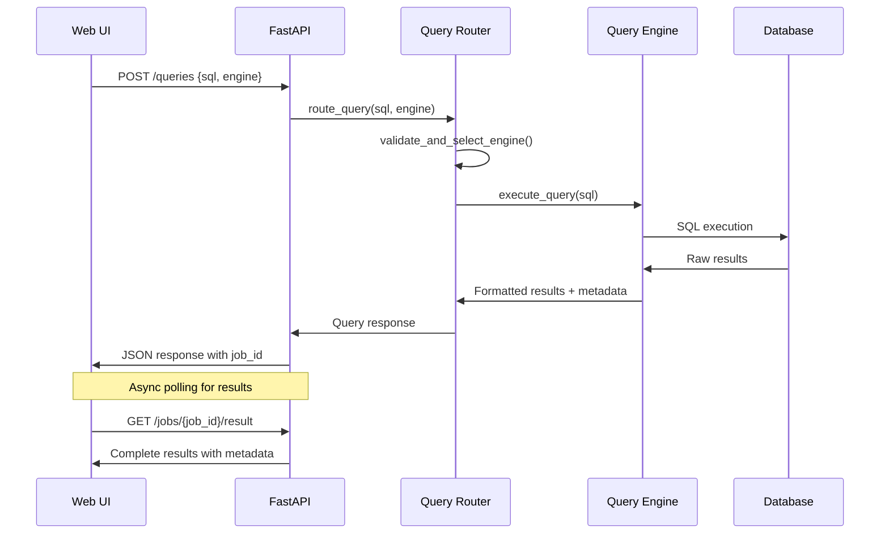
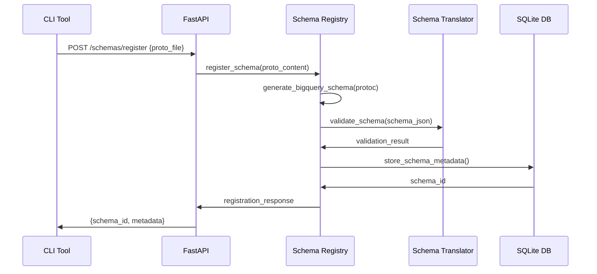
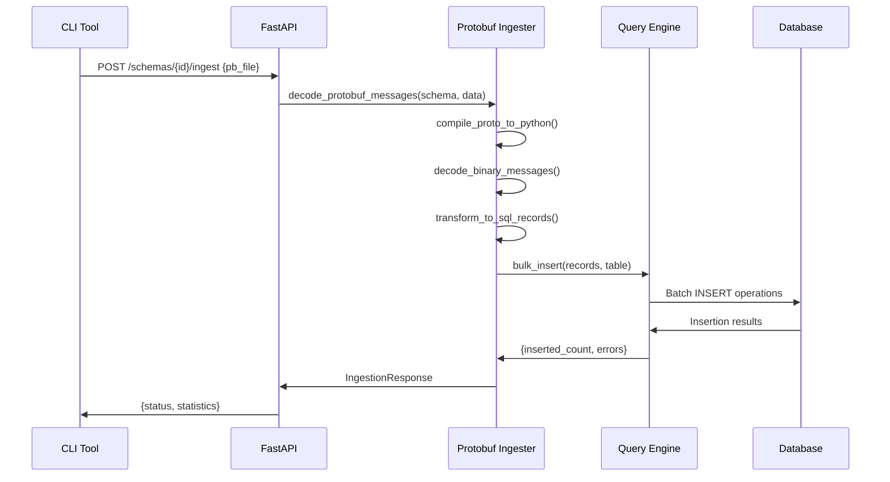

# System Interfaces

## Overview

BigQuery-Lite exposes multiple interfaces for interaction, ranging from user-facing web and CLI interfaces to internal module boundaries and external API integrations. This document describes the complete interface architecture and data flow patterns.

## External Interfaces

### 1. Web User Interface (React Frontend)

**Interface Type**: HTTP/WebSocket Browser Application  
**Port**: 3000 (development), 80 (production)  
**Protocol**: HTTP(S) + WebSocket for real-time updates

#### Primary User Interactions

```typescript
// Query execution interface
interface QuerySubmission {
  sql: string;
  engine: 'duckdb' | 'clickhouse';
  priority: number;
  estimated_slots: number;
}

// Real-time query status updates
interface QueryStatus {
  job_id: string;
  status: 'queued' | 'running' | 'completed' | 'failed';
  progress_percentage: number;
  execution_time_ms: number;
  error_message?: string;
}

// Query results interface
interface QueryResults {
  columns: string[];
  data: any[][];
  row_count: number;
  execution_stats: ExecutionStats;
  query_plan?: QueryPlan;
}
```

#### Web Interface Features

- **SQL Editor**: Monaco editor with syntax highlighting and auto-completion
- **Query Tabs**: Multi-tab interface for concurrent query development
- **Results Visualization**: Tabular data display with sorting and filtering
- **Schema Browser**: Tree view of available tables and columns
- **Job History**: List of executed queries with status and metrics
- **Engine Selection**: Toggle between DuckDB and ClickHouse engines

### 2. Command Line Interface (CLI Tool)

**Interface Type**: HTTP Client over REST API  
**Command**: `bqlite`  
**Protocol**: HTTP(S) REST API calls

#### CLI Command Structure

```bash
# Schema management
bqlite register schema.proto --table user_events --database analytics
bqlite list-schemas
bqlite create-table user_events --engine duckdb

# Data ingestion
bqlite ingest events.pb --schema user_events --engine clickhouse --batch-size 1000

# Query execution
bqlite query "SELECT COUNT(*) FROM user_events" --engine duckdb
bqlite query --file complex_query.sql --engine clickhouse --output csv
```

#### CLI Integration Patterns

```python
# CLI tool API client integration
class BQLiteClient:
    def __init__(self, api_base_url: str):
        self.base_url = api_base_url
        self.session = requests.Session()
    
    def register_schema(self, proto_file: Path, table_name: str) -> str:
        """Register protobuf schema via REST API"""
        with open(proto_file, 'rb') as f:
            response = self.session.post(
                f"{self.base_url}/schemas/register",
                files={'proto_file': f},
                data={'table_name': table_name}
            )
        return response.json()['schema_id']
    
    def execute_query(self, sql: str, engine: str) -> Dict[str, Any]:
        """Execute SQL query and return results"""
        response = self.session.post(
            f"{self.base_url}/queries",
            json={'sql': sql, 'engine': engine}
        )
        job_id = response.json()['job_id']
        return self._poll_job_completion(job_id)
```

### 3. REST API Interface

**Interface Type**: HTTP REST API  
**Port**: 8001  
**Protocol**: HTTP(S) with JSON payloads  
**Documentation**: OpenAPI 3.0 (Swagger/ReDoc)

#### Core API Endpoints

| Category | Endpoint | Method | Purpose | Input | Output |
|----------|----------|--------|---------|-------|--------|
| **Health** | `/health` | GET | Service health | None | `HealthStatus` |
| **Queries** | `/queries` | POST | Submit query | `QueryRequest` | `QueryResponse` |
|          | `/jobs/{id}` | GET | Job status | job_id | `JobStatus` |
|          | `/jobs/{id}/result` | GET | Query results | job_id | `QueryResult` |
| **Schemas** | `/schemas/register` | POST | Register schema | proto_file | `SchemaResponse` |
|           | `/schemas` | GET | List schemas | filters | `SchemaList` |
|           | `/schemas/{id}` | GET | Schema details | schema_id | `SchemaDetails` |
| **Data** | `/schemas/{id}/ingest` | POST | Ingest data | pb_file | `IngestionResponse` |

#### API Request/Response Formats

```python
# Request models with validation
class QueryRequest(BaseModel):
    sql: str = Field(..., min_length=1, description="SQL query")
    engine: str = Field(..., regex="^(duckdb|clickhouse)$")
    priority: int = Field(default=1, ge=1, le=5)
    estimated_slots: int = Field(default=1, ge=1, le=10)

# Response models with metadata
class QueryResponse(BaseModel):
    job_id: str = Field(..., description="Unique job identifier")
    status: str = Field(..., description="Initial job status")
    message: str = Field(..., description="Human-readable message")
    estimated_completion_time: Optional[datetime]

# Error response format
class ErrorResponse(BaseModel):
    detail: str = Field(..., description="Error description")
    error_code: str = Field(..., description="Machine-readable error code")
    timestamp: datetime = Field(default_factory=datetime.now)
```

## Internal Module Boundaries

### 1. API Layer to Business Logic

**Interface Pattern**: Dependency Injection with FastAPI

```python
# Clean separation using dependency injection
@app.post("/queries")
async def submit_query(
    request: QueryRequest,
    query_router: QueryRouter = Depends(get_query_router),
    job_manager: JobManager = Depends(get_job_manager),
    auth: UserAuth = Depends(get_current_user)  # Future
):
    """API endpoint delegates to business logic components"""
    
    # Validate and route query
    engine = query_router.select_engine(request.sql, request.engine)
    
    # Submit to job manager
    job_id = await job_manager.submit_job(
        sql=request.sql,
        engine=engine,
        user_id=auth.user_id,
        priority=request.priority
    )
    
    return QueryResponse(job_id=job_id, status="queued")
```

### 2. Query Router to Engine Runners

**Interface Pattern**: Strategy Pattern with Common Interface

```python
# Abstract base for all query engines
class QueryEngineInterface(ABC):
    @abstractmethod
    async def initialize(self) -> None:
        """Initialize engine connection"""
        pass
    
    @abstractmethod
    async def execute_query(self, sql: str) -> Dict[str, Any]:
        """Execute SQL and return results"""
        pass
    
    @abstractmethod
    async def health_check(self) -> bool:
        """Check engine availability"""
        pass
    
    @abstractmethod
    async def cleanup(self) -> None:
        """Clean up resources"""
        pass

# Engine-specific implementations
class DuckDBRunner(QueryEngineInterface):
    async def execute_query(self, sql: str) -> Dict[str, Any]:
        # DuckDB-specific execution logic
        pass

class ClickHouseRunner(QueryEngineInterface):
    async def execute_query(self, sql: str) -> Dict[str, Any]:
        # ClickHouse-specific execution logic
        pass

# Router delegates to appropriate engine
class QueryRouter:
    def __init__(self, engines: Dict[str, QueryEngineInterface]):
        self.engines = engines
    
    async def execute_query(self, sql: str, engine_name: str) -> Dict[str, Any]:
        engine = self.engines[engine_name]
        return await engine.execute_query(sql)
```

### 3. Schema Management Interface

**Interface Pattern**: Repository Pattern with Version Control

```python
# Schema repository interface
class SchemaRepositoryInterface(ABC):
    @abstractmethod
    async def register_schema(self, proto_content: str, metadata: Dict) -> str:
        """Register new schema version"""
        pass
    
    @abstractmethod
    async def get_schema(self, schema_id: str) -> SchemaVersion:
        """Retrieve schema by ID"""
        pass
    
    @abstractmethod
    async def list_schemas(self, filters: Dict) -> List[SchemaMetadata]:
        """List schemas with filtering"""
        pass

# Schema translation interface
class SchemaTranslatorInterface(ABC):
    @abstractmethod
    def translate_to_duckdb_ddl(self, schema: Dict) -> str:
        """Generate DuckDB DDL"""
        pass
    
    @abstractmethod
    def translate_to_clickhouse_ddl(self, schema: Dict) -> str:
        """Generate ClickHouse DDL"""
        pass

# Integration between components
class SchemaService:
    def __init__(self, 
                 repository: SchemaRepositoryInterface,
                 translator: SchemaTranslatorInterface):
        self.repository = repository
        self.translator = translator
    
    async def create_table_from_schema(self, schema_id: str, engine: str):
        schema = await self.repository.get_schema(schema_id)
        
        if engine == 'duckdb':
            ddl = self.translator.translate_to_duckdb_ddl(schema.schema_json)
        elif engine == 'clickhouse':
            ddl = self.translator.translate_to_clickhouse_ddl(schema.schema_json)
        
        # Execute DDL on target engine
        await self._execute_ddl(ddl, engine)
```

### 4. Data Ingestion Pipeline

**Interface Pattern**: Pipeline with Transformation Stages

```python
# Protobuf ingestion pipeline
class ProtobufIngestionPipeline:
    def __init__(self, 
                 decoder: ProtobufDecoder,
                 transformer: DataTransformer,
                 loader: DataLoader):
        self.decoder = decoder
        self.transformer = transformer
        self.loader = loader
    
    async def ingest_protobuf_data(self, 
                                  schema_id: str, 
                                  pb_data: bytes, 
                                  target_engine: str) -> IngestionResult:
        """Complete ingestion pipeline"""
        
        # Stage 1: Decode protobuf messages
        messages = await self.decoder.decode_messages(schema_id, pb_data)
        
        # Stage 2: Transform to SQL records
        records = await self.transformer.transform_to_records(messages, schema_id)
        
        # Stage 3: Load into target database
        result = await self.loader.bulk_insert(records, target_engine)
        
        return IngestionResult(
            records_processed=len(messages),
            records_inserted=result.inserted_count,
            errors=result.errors,
            execution_time_ms=result.execution_time_ms
        )
```

## Data Flow Patterns

### 1. Query Execution Flow



### 2. Schema Registration Flow



### 3. Data Ingestion Flow



## Configuration Interfaces

### Environment-Based Configuration

```python
# Centralized configuration management
class AppConfig:
    # API Configuration
    HOST: str = Field(default="0.0.0.0", env="HOST")
    PORT: int = Field(default=8001, env="PORT")
    ENVIRONMENT: str = Field(default="development", env="ENVIRONMENT")
    
    # Database Configuration
    CLICKHOUSE_HOST: str = Field(default="localhost", env="CLICKHOUSE_HOST")
    CLICKHOUSE_PORT: int = Field(default=8123, env="CLICKHOUSE_PORT")
    CLICKHOUSE_USER: str = Field(default="admin", env="CLICKHOUSE_USER")
    CLICKHOUSE_PASSWORD: str = Field(default="password", env="CLICKHOUSE_PASSWORD")
    
    # Performance Configuration
    MAX_CONCURRENT_JOBS: int = Field(default=10, env="MAX_CONCURRENT_JOBS")
    QUERY_TIMEOUT_SECONDS: int = Field(default=300, env="QUERY_TIMEOUT_SECONDS")
    RESULT_CACHE_TTL_SECONDS: int = Field(default=3600, env="RESULT_CACHE_TTL_SECONDS")
    
    class Config:
        env_file = ".env"
        case_sensitive = True

# Configuration injection
@lru_cache()
def get_settings() -> AppConfig:
    return AppConfig()

# Usage in application
@app.on_event("startup")
async def configure_application():
    config = get_settings()
    # Initialize components with configuration
```

## Error Handling Interfaces

### Standardized Error Response Format

```python
# Common error response structure
class APIError(BaseModel):
    error_code: str = Field(..., description="Machine-readable error identifier")
    message: str = Field(..., description="Human-readable error message")
    details: Optional[Dict[str, Any]] = Field(default=None, description="Additional error context")
    timestamp: datetime = Field(default_factory=datetime.now)
    request_id: Optional[str] = Field(default=None, description="Request correlation ID")

# Error categories with specific codes
class ErrorCodes:
    # Query Execution Errors
    QUERY_SYNTAX_ERROR = "QUERY_SYNTAX_ERROR"
    QUERY_TIMEOUT = "QUERY_TIMEOUT"
    ENGINE_UNAVAILABLE = "ENGINE_UNAVAILABLE"
    
    # Schema Management Errors
    SCHEMA_VALIDATION_FAILED = "SCHEMA_VALIDATION_FAILED"
    PROTOC_COMPILATION_FAILED = "PROTOC_COMPILATION_FAILED"
    SCHEMA_NOT_FOUND = "SCHEMA_NOT_FOUND"
    
    # Data Ingestion Errors
    PROTOBUF_DECODING_FAILED = "PROTOBUF_DECODING_FAILED"
    DATA_VALIDATION_FAILED = "DATA_VALIDATION_FAILED"
    BULK_INSERT_FAILED = "BULK_INSERT_FAILED"

# Error handling middleware
@app.exception_handler(ValidationError)
async def validation_exception_handler(request: Request, exc: ValidationError):
    return JSONResponse(
        status_code=422,
        content=APIError(
            error_code=ErrorCodes.SCHEMA_VALIDATION_FAILED,
            message="Request validation failed",
            details=exc.errors(),
            request_id=getattr(request.state, 'request_id', None)
        ).dict()
    )
```

## Security Interfaces (Planned)

### Authentication and Authorization

```python
# Future authentication interface
class AuthenticationInterface(ABC):
    @abstractmethod
    async def authenticate_request(self, request: Request) -> Optional[User]:
        """Authenticate incoming request"""
        pass
    
    @abstractmethod
    async def authorize_action(self, user: User, action: str, resource: str) -> bool:
        """Authorize user action on resource"""
        pass

# JWT-based implementation (planned)
class JWTAuthenticator(AuthenticationInterface):
    async def authenticate_request(self, request: Request) -> Optional[User]:
        token = request.headers.get("Authorization")
        if token:
            return self.validate_jwt_token(token)
        return None
    
    async def authorize_action(self, user: User, action: str, resource: str) -> bool:
        return user.has_permission(action, resource)

# Role-based access control (planned)
@app.post("/schemas/register")
async def register_schema(
    request: SchemaRegistrationRequest,
    user: User = Depends(get_current_user),
    auth: AuthenticationInterface = Depends(get_authenticator)
):
    if not await auth.authorize_action(user, "schema:create", "*"):
        raise HTTPException(status_code=403, detail="Insufficient permissions")
    
    # Proceed with schema registration
```

This comprehensive interface documentation provides a complete view of how different components communicate within BigQuery-Lite, enabling developers to understand integration points and extend the system effectively.
