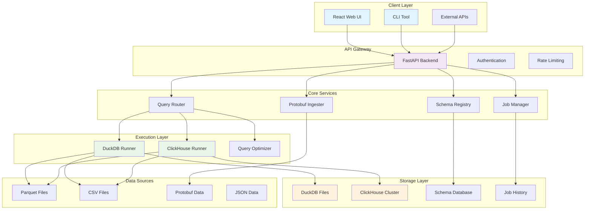
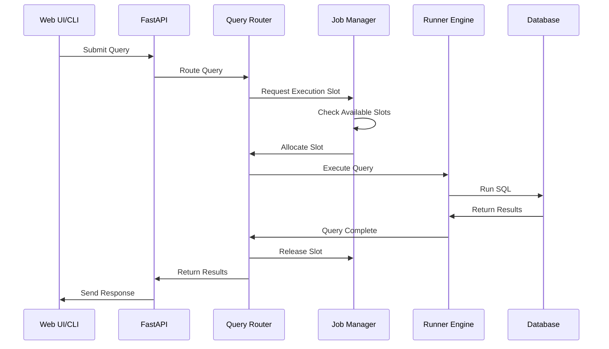
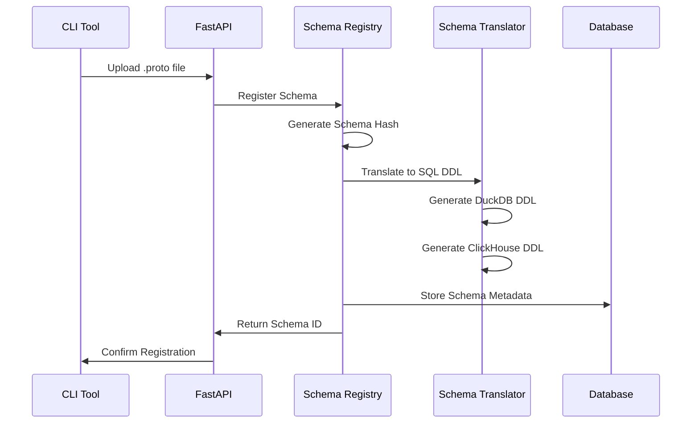
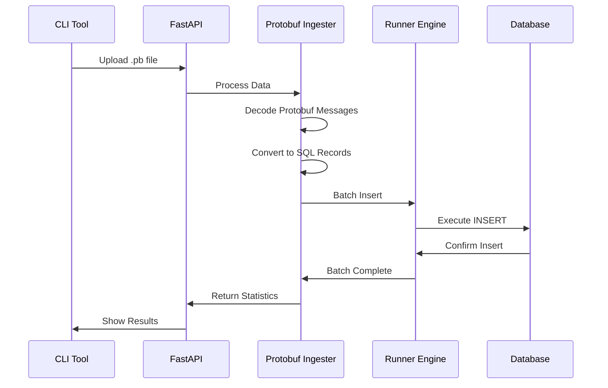

# System Architecture Overview

BigQuery-Lite is designed as a comprehensive local analytics platform that mimics Google BigQuery's functionality while running entirely on your local infrastructure. This document provides a high-level overview of the system architecture and design decisions.

## Architecture Goals

### Primary Objectives
1. **BigQuery Compatibility** - Provide familiar BigQuery experience for development and testing
2. **Dual Engine Support** - Leverage both DuckDB (embedded) and ClickHouse (distributed) for different use cases
3. **Schema-Driven Development** - Use Protocol Buffers as single source of truth for data models
4. **Production Readiness** - Support real-world analytics workloads with proper resource management
5. **Developer Experience** - Intuitive interface and tooling for rapid development

### Design Principles
- **Modular Architecture** - Components can be developed and deployed independently
- **Engine Abstraction** - Unified interface across different database engines
- **Async Processing** - Non-blocking operations for better performance
- **Resource Management** - Slot-based execution model similar to BigQuery
- **Type Safety** - Strong typing through protobuf schema management

## High-Level Architecture

## Component Overview

### Frontend Layer

#### React Web Interface
- **Technology**: React 18 + Monaco Editor
- **Purpose**: Primary user interface for query development and data exploration
- **Features**: 
  - SQL editor with syntax highlighting
  - Real-time query execution
  - Result visualization
  - Schema browser
  - Job history management
- **Communication**: REST API calls to FastAPI backend

#### CLI Tool (`bqlite`)
- **Technology**: Python + Typer + Rich
- **Purpose**: Command-line interface for automation and CI/CD integration
- **Features**:
  - Schema registration and management
  - Data ingestion
  - Table creation
  - Batch operations
- **Communication**: HTTP client to REST API

### Backend Layer

#### FastAPI Application
- **Technology**: Python + FastAPI + Uvicorn
- **Purpose**: Central API server and request routing
- **Responsibilities**:
  - Request validation and routing
  - Authentication and authorization (planned)
  - API documentation generation
  - Error handling and logging
  - Health checks and monitoring

#### Core Services

**Query Router**
- Routes queries to appropriate execution engines
- Implements load balancing and failover
- Manages query queuing and prioritization
- Provides unified interface across engines

**Schema Registry**
- Manages protobuf schema definitions
- Handles schema versioning and evolution
- Provides schema translation services
- Stores schema metadata and relationships

**Job Manager**
- Implements slot-based resource management
- Manages query execution lifecycle
- Provides job status tracking
- Handles concurrent execution limits

**Protobuf Ingester**
- Processes binary protobuf data
- Converts protobuf messages to SQL records
- Handles batch ingestion operations
- Provides data validation and error reporting

### Execution Layer

#### DuckDB Runner
- **Purpose**: Embedded analytical processing
- **Use Cases**: 
  - Development and testing
  - Interactive data exploration
  - Small to medium datasets (< 1GB)
  - Rapid prototyping
- **Features**:
  - In-process execution (no network overhead)
  - Rich SQL feature set
  - Excellent performance for OLAP queries
  - Native Parquet support

#### ClickHouse Runner
- **Purpose**: Distributed analytical processing
- **Use Cases**:
  - Production analytics workloads
  - Large datasets (> 1GB)
  - Multi-user environments
  - Real-time analytics
- **Features**:
  - Horizontal scaling
  - Columnar storage
  - Advanced compression
  - Distributed query processing

### Storage Layer

#### Data Storage
- **DuckDB Files**: Local database files for embedded storage
- **ClickHouse Cluster**: Distributed storage across multiple nodes
- **Parquet Files**: Shared data storage format
- **Schema Database**: SQLite database for schema metadata
- **Job History**: Persistent job execution history

#### Data Formats
- **Primary**: Parquet (columnar, compressed)
- **Input**: CSV, JSON, Protobuf
- **Metadata**: SQLite for fast lookups
- **Configuration**: YAML/JSON files

## Data Flow Architecture

### Query Execution Flow

### Schema Registration Flow

### Data Ingestion Flow

## Technology Stack

### Frontend Technologies
- **React 18**: Modern UI framework with hooks and concurrent features
- **Monaco Editor**: VS Code editor for SQL editing
- **Axios**: HTTP client for API communication
- **CSS Modules**: Scoped styling
- **Create React App**: Build tooling and development server

### Backend Technologies
- **Python 3.11+**: Modern Python with type hints and async support
- **FastAPI**: High-performance async web framework
- **Pydantic**: Data validation and serialization
- **SQLAlchemy**: Database ORM and query building
- **Uvicorn**: ASGI server for production deployment

### Database Technologies
- **DuckDB**: Embedded analytical database
- **ClickHouse**: Distributed columnar database
- **SQLite**: Metadata and configuration storage
- **Parquet**: Columnar file format for data exchange

### DevOps Technologies
- **Docker**: Containerization and deployment
- **Docker Compose**: Multi-service orchestration
- **Nginx**: Reverse proxy and static file serving
- **GitHub Actions**: CI/CD pipeline (planned)

## Security Architecture

### Current Security Model
- **Network Security**: Internal service communication
- **Input Validation**: Pydantic models for all API inputs
- **SQL Injection Prevention**: Parameterized queries only
- **File Upload Validation**: Type and size restrictions

### Planned Security Features
- **Authentication**: JWT-based user authentication
- **Authorization**: Role-based access control (RBAC)
- **API Keys**: Service-to-service authentication
- **Audit Logging**: Comprehensive operation logging
- **Data Encryption**: At-rest and in-transit encryption

## Scalability Considerations

### Horizontal Scaling
- **Frontend**: Multiple UI instances behind load balancer
- **Backend**: Multiple FastAPI instances with shared state
- **ClickHouse**: Native clustering and sharding support
- **Storage**: Distributed file systems for large datasets

### Vertical Scaling
- **Memory**: Configurable memory limits per component
- **CPU**: Multi-threaded query execution
- **Storage**: SSD optimization for better I/O performance
- **Network**: Connection pooling and async I/O

### Performance Optimization
- **Query Caching**: Identical query result caching
- **Schema Caching**: Compiled schema caching
- **Connection Pooling**: Database connection reuse
- **Batch Processing**: Efficient bulk operations

## Monitoring and Observability

### Metrics Collection
- **Query Performance**: Execution time, memory usage, row counts
- **System Health**: CPU, memory, disk usage
- **API Metrics**: Request rate, response time, error rate
- **Database Metrics**: Connection count, query queue depth

### Logging Strategy
- **Structured Logging**: JSON format for machine parsing
- **Log Levels**: DEBUG, INFO, WARNING, ERROR, CRITICAL
- **Component Tagging**: Service identification in logs
- **Performance Logging**: Query execution details

### Health Checks
- **Service Health**: Individual component status
- **Dependency Health**: Database connectivity
- **Resource Health**: Memory and disk usage
- **End-to-End Health**: Complete workflow validation

## Extension Points

### Plugin Architecture (Planned)
- **Custom Runners**: Additional database engine support
- **Data Connectors**: New data source integrations
- **Authentication Providers**: External auth integration
- **Custom Functions**: User-defined SQL functions

### API Extensibility
- **Webhook Support**: Event-driven integrations
- **GraphQL**: Alternative query interface (planned)
- **Streaming APIs**: Real-time data feeds
- **Bulk APIs**: High-throughput operations

## Next Steps

- **[Backend Architecture](backend.md)** - Detailed backend component documentation
- **[Frontend Architecture](frontend.md)** - React application structure
- **[Database Engines](engines.md)** - DuckDB and ClickHouse integration details
- **[Deployment Guide](../deployment/docker.md)** - Production deployment strategies