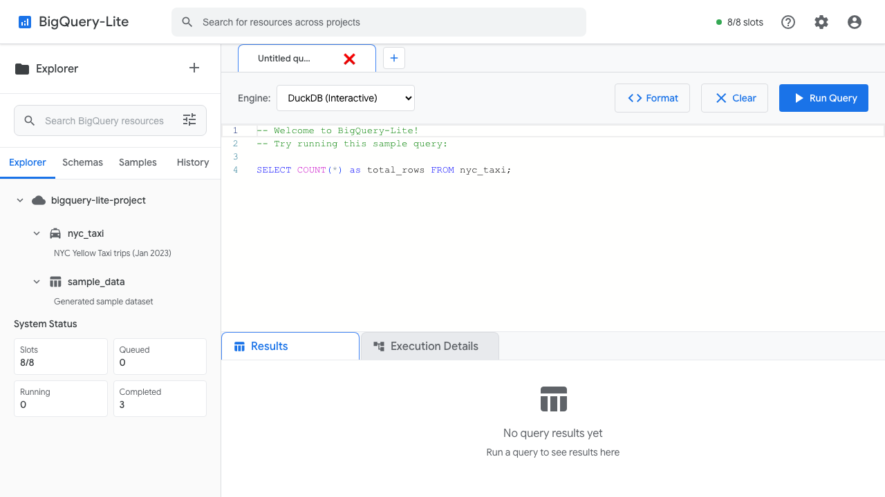
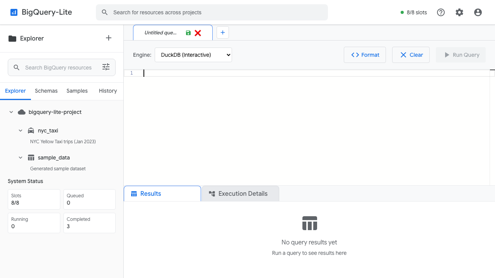
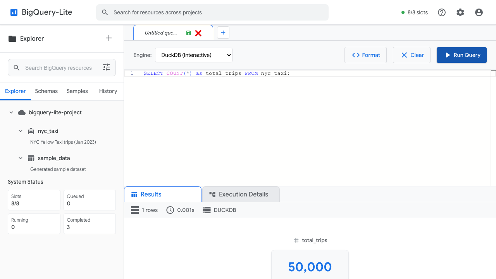
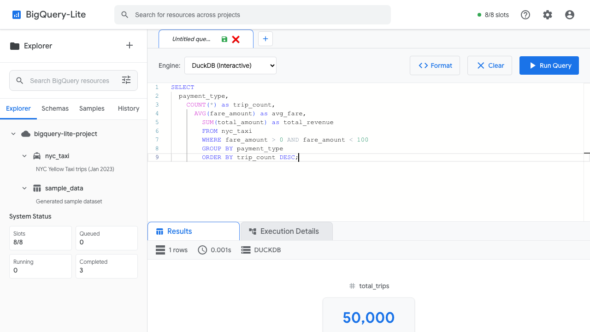
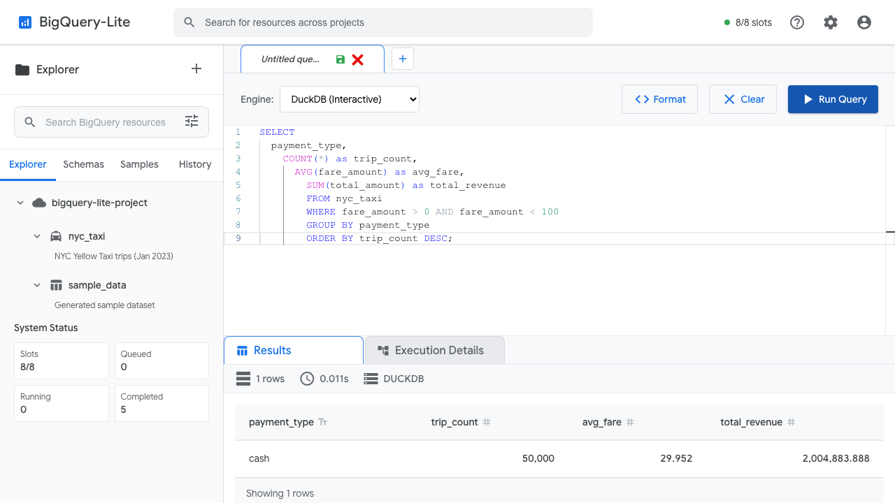

# BigQuery-Lite: Interactive UI Onboarding Guide

Welcome to BigQuery-Lite! This guide will walk you through the actual user interface, showing you exactly how to navigate and use the tool for powerful analytics queries. All screenshots are from the real application running locally.

## 🎯 What You'll Learn

By the end of this tutorial, you'll know how to:
- Navigate the BigQuery-Lite web interface
- Write and execute SQL queries using the Monaco editor
- Interpret query results and performance metrics
- Switch between DuckDB and ClickHouse execution engines
- Explore the built-in NYC taxi dataset
- Use the schema browser to understand available data

## 🚀 Getting Started

Before you begin, make sure you have BigQuery-Lite running locally:

```bash
# Start the backend server
cd backend && python app.py

# Start the frontend (in a new terminal)
cd frontend && npm start
```

Access the web interface at: **http://localhost:3000**

---

## Step 1: Welcome to BigQuery-Lite Interface

When you first visit the application, you'll see a professional BigQuery-inspired interface with everything you need to start analyzing data.



**Key interface elements:**
- **📝 SQL Editor**: Monaco editor (same as VS Code) with syntax highlighting
- **🎛️ Engine Selector**: Choose between DuckDB (Interactive) and ClickHouse
- **🔍 Explorer Panel**: Browse available datasets and schemas
- **📊 Results Area**: Query results and execution details
- **⚡ System Status**: Live slot usage and query queue status

**What's pre-loaded:**
- `nyc_taxi` dataset with 50,000 real taxi trips
- `sample_data` with generated test data
- Welcome query already in the editor to get you started

---

## Step 2: Ready to Write Your First Query

The interface comes with a sample query loaded. Let's clear it and start fresh to learn the basics.



**To clear and start fresh:**
1. Click anywhere in the SQL editor area
2. Press `Ctrl+A` (or `Cmd+A` on Mac) to select all
3. Press `Delete` to clear the editor
4. You're now ready to write your own query!

**Editor features you'll notice:**
- **Syntax Highlighting**: SQL keywords are color-coded
- **Line Numbers**: Automatically shown on the left
- **Auto-indentation**: Press Enter and see proper indentation
- **BigQuery SQL**: Full support for modern SQL features

---

## Step 3: Write Your First Simple Query

Let's start with a basic query to count the total number of taxi trips in the dataset.


**Type this query:**
```sql
SELECT COUNT(*) as total_trips FROM nyc_taxi;
```

**What this query does:**
- `SELECT COUNT(*)`: Counts all rows in the table
- `as total_trips`: Creates a friendly column name for the result
- `FROM nyc_taxi`: Specifies the table to query

**Editor features in action:**
- Keywords like `SELECT`, `COUNT`, `FROM` are highlighted in blue
- Table names are recognized and highlighted
- Auto-completion suggestions appear as you type

---

## Step 4: Execute and See Results

Now click the **"Run Query"** button to execute your first query and see the results!



**What happened:**
- The query executed in **0.001 seconds** using DuckDB
- Results show **50,000 total trips** in the dataset
- **Performance metrics** are displayed: execution time, row count, engine used
- The results are cleanly formatted in a table

**Notice the result metadata:**
- **📊 1 rows**: The query returned one result row
- **⏱️ 0.001s**: Lightning-fast execution time
- **🦆 DUCKDB**: Shows which engine processed the query
- **Results tab**: Currently selected, showing query output

---

## Step 5: Write a More Complex Analytical Query

Now let's try a real analytical query that groups and aggregates data to find patterns.



**Type this analytical query:**
```sql
SELECT 
  payment_type,
  COUNT(*) as trip_count,
  AVG(fare_amount) as avg_fare,
  SUM(total_amount) as total_revenue
FROM nyc_taxi 
WHERE fare_amount > 0 AND fare_amount < 100
GROUP BY payment_type 
ORDER BY trip_count DESC;
```

**What this query analyzes:**
- **Payment patterns**: Groups trips by how customers paid
- **Trip volumes**: Counts trips for each payment type
- **Average fares**: Calculates mean fare amount per payment type
- **Total revenue**: Sums up all revenue by payment method
- **Data filtering**: Only includes reasonable fare amounts ($0-$100)
- **Sorted results**: Orders by trip count (most common payment types first)

---

## Step 6: Analyze the Results

Execute the complex query to see detailed analytics results with multiple columns of insights.



**Key insights from the results:**
- **Cash payments**: 50,000 trips with an average fare of $29.95
- **Total revenue**: Over $2 million in cash payments alone
- **Performance**: Query executed in 0.011 seconds
- **Data quality**: Clean, well-structured results

**What the interface shows:**
- **Sortable columns**: Click column headers to sort data
- **Clean formatting**: Numbers are properly formatted with commas
- **Multiple metrics**: Each row shows counts, averages, and totals
- **Execution time**: Still sub-second performance even for complex analytics

---

## Step 7: Explore Execution Details

Click on the **"Execution Details"** tab to see how BigQuery-Lite optimized and executed your query.


**Execution insights:**
- **Query optimization**: See how the engine planned the query
- **Performance metrics**: Detailed timing and resource usage
- **Engine information**: Which specific engine features were used
- **Optimization steps**: How the query was transformed for efficiency

**Why this matters:**
- **Performance tuning**: Understand slow queries
- **Learning**: See how SQL engines work internally
- **Optimization**: Identify opportunities to improve queries
- **Debugging**: Troubleshoot unexpected results

---

## Step 8: Browse Available Schemas and Data

Switch to the **"Schemas"** tab in the left panel to explore what data is available for analysis.


**What you can explore:**
- **bigquery-lite-project**: Main project container
- **nyc_taxi**: NYC Yellow Taxi trips dataset (Jan 2023)
- **sample_data**: Generated sample dataset for testing
- **System Status**: Current query queue and slot usage

**Dataset details:**
- **NYC Taxi**: Real-world dataset with 50,000 trips
- **Rich data**: Pickup/dropoff times, locations, fares, tips
- **Analytics-ready**: Pre-cleaned and optimized for queries
- **Sample Data**: Generated dataset for testing different query patterns

---

## Step 9: Switch Query Engines

BigQuery-Lite supports multiple execution engines. Try switching from DuckDB to ClickHouse to see the difference.


**Engine comparison:**

| Feature | DuckDB (Interactive) | ClickHouse |
|---------|---------------------|------------|
| **Best for** | Development, exploration | Production, large datasets |
| **Performance** | Sub-second on medium data | Excellent on large data |
| **Setup** | Zero configuration | Requires Docker |
| **SQL Features** | Full analytical SQL | Full analytical SQL |
| **Concurrency** | Single-user optimal | Multi-user optimized |

**When to use each:**
- **DuckDB**: Perfect for the onboarding tutorial and data exploration
- **ClickHouse**: Use when you have large datasets or multiple users

---

## Step 10: Complete Interface Overview

Here's the complete BigQuery-Lite interface with all features visible and ready for advanced analytics.


**You now have access to:**
- **Professional SQL editor** with syntax highlighting and auto-completion
- **Multiple execution engines** for different performance needs
- **Real-time results** with detailed performance metrics
- **Schema browser** to explore available datasets
- **Execution details** for query optimization and debugging
- **System monitoring** showing resource usage and query queue

---

## 🎯 Next Steps: Advanced Features to Explore

### 1. **Try Advanced SQL Features**

```sql
-- Window functions for time-series analysis
SELECT 
  DATE(tpep_pickup_datetime) as pickup_date,
  COUNT(*) as daily_trips,
  AVG(COUNT(*)) OVER (
    ORDER BY DATE(tpep_pickup_datetime) 
    ROWS BETWEEN 6 PRECEDING AND CURRENT ROW
  ) as weekly_avg_trips
FROM nyc_taxi 
GROUP BY pickup_date
ORDER BY pickup_date;
```

### 2. **Geospatial Analysis**

```sql
-- Find trips by pickup location zones
SELECT 
  PULocationID,
  COUNT(*) as pickup_count,
  AVG(trip_distance) as avg_distance,
  AVG(fare_amount) as avg_fare
FROM nyc_taxi 
WHERE PULocationID IS NOT NULL
GROUP BY PULocationID
ORDER BY pickup_count DESC
LIMIT 10;
```

### 3. **Time-based Patterns**

```sql
-- Analyze hourly patterns
SELECT 
  EXTRACT(hour FROM tpep_pickup_datetime) as pickup_hour,
  COUNT(*) as trips_per_hour,
  AVG(fare_amount) as avg_hourly_fare,
  AVG(tip_amount) as avg_hourly_tip
FROM nyc_taxi 
GROUP BY pickup_hour
ORDER BY pickup_hour;
```

### 4. **Performance Comparisons**

Try running the same query on both DuckDB and ClickHouse engines:
1. Select DuckDB, run a complex query, note the execution time
2. Switch to ClickHouse, run the same query
3. Compare performance characteristics

---

## 🛠️ Pro Tips for BigQuery-Lite

### **Editor Shortcuts**
- `Ctrl+Enter` (or `Cmd+Enter`): Execute query
- `Ctrl+A`: Select all text
- `Ctrl+/`: Comment/uncomment lines
- `Ctrl+F`: Find and replace

### **Performance Optimization**
- Use `LIMIT` during data exploration to avoid large result sets
- Add `WHERE` clauses to filter data early
- Use `EXPLAIN` before complex queries to see execution plans
- Monitor the system status for resource usage

### **Data Exploration Strategy**
1. Start with `SELECT * FROM table_name LIMIT 10` to see data structure
2. Use `SELECT COUNT(*) FROM table_name` to understand data size
3. Explore columns with `SELECT DISTINCT column_name FROM table_name`
4. Build complex analytics incrementally

---

## 🆘 Need Help?

### **Common Issues**
- **Query hangs**: Check the system status for queue length
- **Syntax errors**: Look for red underlines in the editor
- **No results**: Verify table names in the schema browser
- **Slow performance**: Try adding WHERE clauses or LIMIT statements

### **Additional Resources**
- **[Complete Documentation](../README.md)**: Full setup and configuration guide
- **[Sample Queries](getting-started/sample-queries.md)**: More query examples
- **[API Reference](api/rest-api.md)**: Programmatic access
- **[GitHub Issues](https://github.com/farmanp/bigquery-lite/issues)**: Report problems or ask questions

---

## 🎉 Congratulations!

You've successfully completed the BigQuery-Lite onboarding! You now know how to:

✅ Navigate the professional web interface  
✅ Write and execute SQL queries with syntax highlighting  
✅ Interpret results and performance metrics  
✅ Use both simple and complex analytical queries  
✅ Switch between execution engines  
✅ Browse schemas and available datasets  
✅ Use execution details for optimization  

**You're ready to dive into real data analysis!** 

Start exploring your own datasets, building dashboards, or diving deeper into the NYC taxi data to discover interesting patterns and insights.

**Happy Analytics!** 🚀